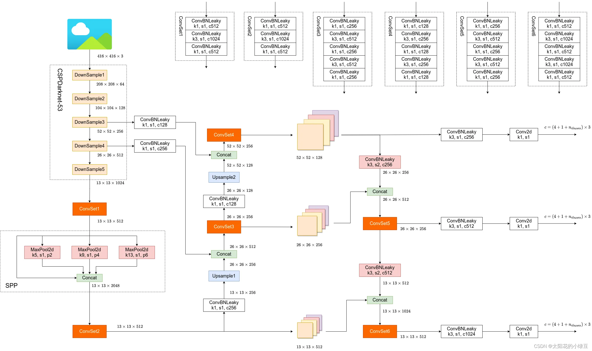

+++
title = "YOLOV4"
date = 2023-11-27

[taxonomies]
categories = ["2023"]
tags = ["yolo"]

[extra]
lang = "en"
toc = true
comment = true
copy = true
math = false
mermaid = false
outdate_alert = true
outdate_alert_days = 120
display_tags = true
truncate_summary = false

+++

# YOLOv4



.webp)

## 网络结构

- Backbone： CSPDarknet53
- Neck： SPP， PANet
- Head： YOLOv3

## 1x1 卷积核的作用：

- 在通道层面上进行降维或者升维，相比 3x3 卷积层不会破坏长宽上的特征图信息
- 1x1 实际上做的就是对平面上一个像素点在不同通道上的加权和
- 如果 1x1 卷积核的输入输出 channel 数相同，意味着没有升维和降维，只是同一像素点不同通道的特征整合

## CSP 结构：

.webp)

计算过程：

在 CSPNet 中 CSP 结构的计算方法是将输入特征图在 channel 通道上分成两部分，其中一部分经过 Denseblock 等计算然后再与另一部分进行 contact；而在 YOLOv4 里，输入并没有被分成两部分，而是通过两个 1x1 的卷积层，这两个卷积层的卷积核个数是输入特征图的 channel 层数的一半，是利用1x1卷积核的降维作用将输入弄成了两份，而不是直接对半切，可以保留一部分原有特征

代码：

```python
class Resblock_body(nn.Module):
    def __init__(self, in_channels, out_channels, num_blocks, first):
        super(Resblock_body, self).__init__()

        self.downsample_conv = BasicConv(in_channels, out_channels, 3, stride=2)

        # 如果是第一个残差体（总共有 5 个）
        if first:
            self.part0_conv = BasicConv(out_channels, out_channels, 1)

            self.part1_conv = BasicConv(out_channels, out_channels, 1)
            self.part1_resblocks_conv = nn.Sequential(
                Resblock(out_channels, out_channels//2),
                BasicConv(out_channels, out_channels, 1)
            )

            self.concat_conv = BasicConv(out_channels*2, out_channels, 1)
        else:
            self.part0_conv = BasicConv(out_channels, out_channels//2, 1)

            self.part1_conv = BasicConv(out_channels, out_channels//2, 1)
            self.part1_resblocks_conv = nn.Sequential(
                *[Resblock(out_channels//2) for _ in range(num_blocks)],
                BasicConv(out_channels//2, out_channels//2, 1)
            )

            self.concat_conv = BasicConv(out_channels, out_channels, 1)

    def forward(self, x):
        x = self.downsample_conv(x)

        part0 = self.part0_conv(x)

        part1 = self.part1_conv(x)
        part1 = self.part1_resblocks_conv(part1)

        x = torch.cat([part0, part1], dim=1)
        x = self.concat_conv(x)

        return x
```

作用：

- 减少计算量：只有一半的输入经过 resblock 的计算，另一半直接 contact
- 减少内存使用：同理

## 残差块

普遍的残差块两个卷积层的卷积核都是 3*3 的，Darknet 中的第一个卷积层的卷积核是 1*1 的，起到改变维度的作用

.webp)

Yolov4中残差块的代码实现是

```python
class Resblock(nn.Module):
    def __init__(self, channels, hidden_channels=None):
        super(Resblock, self).__init__()

        if hidden_channels is None:
            hidden_channels = channels

        self.block = nn.Sequential(
            BasicConv(channels, hidden_channels, 1),  # 降维升维
            BasicConv(hidden_channels, channels, 3)
        )

    def forward(self, x):
        return x + self.block(x)
```

## CSPDarknet53

.webp)

由输入层，DarknetConv2d_BN_Mish层，和 5 个 Resblock_body 组成

DarknetConv2d_BN_Mish 就是一个简单的 Basicconv，用于把图像通道升维成 32

Resblock_body 是 CSP 结构，CSP 结构是将输入一部分经过简单的 1 x 1 卷积核降维，另一部分也进行同样的降维，然后这部分需要输入到 n 个残差层中，再经过一个 1 x 1 卷积层进行特征整合得到输出；将这份输出和第一部分的输出 cat 拼接到一起，拼接后再接一个 1 x 1 的卷积层来恢复特征层数到 out_channels

DarknetConv2d_BN_Mish 和 Resblock_body 以及每个Resblock_body 和Resblock_body 之间都有一个下采样层，也是一个简单的 Basicconv，卷积核 3，步幅2，一次一半缩小特征图分辨率

代码：

```python
class CSPDarknet(nn.Module):
    def __init__(self, layers):
        super(CSPDarknet, self).__init__()
        self.inplanes = 32

        self.conv1 = BasicConv(3, self.inplanes, 3, 1)
        self.feature_channels = [64, 128, 256, 512, 1024]

        self.stages = nn.ModuleList([
            Resblock_body(self.inplanes, self.feature_channels[0], layers[0], first=True),
            Resblock_body(self.feature_channels[0], self.feature_channels[1], layers[1], first=False),
            Resblock_body(self.feature_channels[1], self.feature_channels[2], layers[2], first=False),
            Resblock_body(self.feature_channels[2], self.feature_channels[3], layers[3], first=False),
            Resblock_body(self.feature_channels[3], self.feature_channels[4], layers[4], first=False),
        ])

    def forward(self, x):
        x = self.conv1(x)

        x = self.stages[0](x)
        x = self.stages[1](x)
        out3 = self.stages[2](x)
        out4 = self.stages[3](x)
        out5 = self.stages[4](x)

        return out3, out4, out5
```

## SPP多尺度融合

.webp)

5x5 9x9 13x13 ，每个池化层步幅为 1 ，但使用了不同的 padding 来保证池化输出和输入的尺寸相同，一定程度上利用了特征图多尺度信息

使用 SPP结构的好处：

1. 可以任何尺寸输入而获得特定输出，以配合全连接层，无需再对输入进行变形或裁剪，保留原始图像特征
2. 提高模型鲁棒性，用不同尺寸的池化层处理特征图并拼接，提高模型对不同尺度目标变化的鲁棒性

代码：

```python
class SPP(nn.Module):
    def __init__(self, pool_sizes=None):
        super(SPP, self).__init__()

        if pool_sizes is None:
            pool_sizes = [5, 9, 13]

        self.max_pools = nn.ModuleList([nn.MaxPool2d(pool_size, 1, pool_size // 2) for pool_size in pool_sizes])

    def forward(self, x):
        x_pool = [max_pool(x) for max_pool in self.max_pools[::-1]]  # 倒序，原因未知
        x = torch.cat(x_pool + [x], dim=1)

        return x
```

## FPN

.webp)

所谓 FPN 模块，就是将 backbone 输出的多层特征图 C2345先通过 1x1 的卷积层将 channel 统一（因为后边需要相加，要求channel数相同），然后拿最小的特征图上采样到第二小的特征图的尺寸并相加，以此类推一直加到最后一层，其中每次相加结束的输出都作为新的输出 P2345，最小的特征图直接作为新输出，因为它上面没有再小的特征图

FPN 的好处：

1. 多尺度特征融合：利于检测不同大小的目标
2. 利于小目标检测：低层获得了高层的语义信息，增大低层感受野，获得了更多上下文信息

## PAN

PAN 在 FPN的基础上又增加了从低层的高层的特征融合

.webp)

PAN 的好处：

1. 更强的信息流：相比于 FPN，PAN 的高层不仅受低层影响，现在也能影响低层，高低层双向信息流使得模型能更好的结合低层细节和高层语义信息
2. 提高模型鲁棒性：高层获得了底层的细节信息，更有利于判断目标，提高准确率

代码

```python
class YoloBody(nn.Module):
    def __init__(self, anchors_mask, num_classes):
        super(YoloBody, self).__init__()

        self.backbone = darknet53()

        self.make_three_conv1 = make_three_conv([512, 1024], 1024)
        self.SPP = SPP()
        self.make_three_conv2 = make_three_conv([512, 1024], 2048)

        self.upsample1 = Upsample(512, 256)
        self.conv_for_P4 = BasicConv(512, 256, 1)
        self.make_five_conv1 = make_five_conv([256, 512], 512)

        self.upsample2 = Upsample(256, 128)
        self.conv_for_P3 = BasicConv(256, 128, 1)
        self.make_five_conv2 = make_five_conv([128, 256], 256)

        # 3*(5+num_classes) = 3*(5+20) = 3*(4+1+20)=75
        self.yolo_head3 = yolo_head([256, len(anchors_mask[0]) * (5 + num_classes)], 128)

        self.down_sample1 = BasicConv(128, 256, 3, stride=2)
        self.make_five_conv3 = make_five_conv([256, 512], 512)

        # 3*(5+num_classes) = 3*(5+20) = 3*(4+1+20)=75
        self.yolo_head2 = yolo_head([512, len(anchors_mask[1]) * (5 + num_classes)], 256)

        self.down_sample2 = BasicConv(256, 512, 3, stride=2)
        self.make_five_conv4 = make_five_conv([512, 1024], 1024)

        # 3*(5+num_classes)=3*(5+20)=3*(4+1+20)=75
        self.yolo_head1 = yolo_head([1024, len(anchors_mask[2]) * (5 + num_classes)], 512)

    def forward(self, x):
        out3, out4, out5 = self.backbone(x)

        P5 = self.make_three_conv1(out5)
        P5 = self.SPP(P5)
        P5 = self.make_three_conv2(P5)

        P5_upsample = self.upsample1(P5)
        P4 = self.conv_for_P4(out4)
        P4 = torch.cat([P4, P5_upsample], dim=1)
        P4 = self.make_five_conv1(P4)

        P4_upsample = self.upsample2(P4)
        P3 = self.conv_for_P3(out3)
        P3 = torch.cat([P3, P4_upsample], dim=1)
        P3 = self.make_five_conv2(P3)

        P3_downsample = self.down_sample1(P3)
        P4 = torch.cat([P3_downsample, P4], dim=1)
        P4 = self.make_five_conv3(P4)

        P4_downsample = self.down_sample2(P4)
        P5 = torch.cat([P4_downsample, P5], dim=1)
        P5 = self.make_five_conv4(P5)

        out2 = self.yolo_head3(P3)
        out1 = self.yolo_head2(P4)
        out0 = self.yolo_head1(P5)

        return out0, out1, out2
```

## YOLO Head

一个3x3 的卷积和一个 1x1 的卷积组合

目的是将特征图通道数变为 num_anchors * ( 5 + num_classes )

5 代表 xywh 和 conf，num_classes 代表类别数，它的值代表属于这个类别的概率，conf 代表框的置信度

代码：

```python
def yolo_head(filters_list, in_filters):
    m = nn.Sequential(
        BasicConv(in_filters, filters_list[0], 3),
        nn.Conv2d(filters_list[0], filters_list[1], 1)
    )
    return m
```

## 先验框

#### YOLO 不直接预测先验框的 xywh，而是预测与先验框 xywh 的差，先验框是提前固定生成的

为什么需要先验框：

1. 提高检测效率：使用先验框作为起点，网络只需要调整这些框来更好地拟合特定的对象，而不是从零开始预测边界框。
2. 应对不同形状和大小的对象：对于被检测对象的各种形状和大小，先验框提供了一种简单的方法来预定义不同比例和宽高比的框，这有助于网络更有效地识别和定位各种大小和形状的对象。
3. 改善训练稳定性：先验框提供了一个较好的起点，模型在训练初期就能比较准确的预测目标位置，可以改善训练稳定性并加速收敛

先验框的生成：

1. 生成 （1， 3， 13， 13）的网格
2. 将预定的锚框宽高化成特征图比例的锚框宽高
3. 网格上每个点就是先验框的中心点，转化后的锚框宽高就是先验框的锚框宽高

先验框的修正：

1. 将锚框的 xy 加上 模型的输出 xy
2. 将猫框的 wh 加上模型的输出 wh(wh取e，保证为正数)

训练时如何确定锚框：

1. 看 GT 的中心点落在特征图上哪个网格内，由此网格的三个锚框负责预测
2. 使GT 与三个锚框 IOU 最大的那个锚框负责计算偏移损失和类别损失，其他两个锚框只计算类别损失
3. 规定一格网格内只会有一个 GT

代码：

```python
class DecodeBox(nn.Module):
    def __init__(self, anchors, num_classes, input_shape, anchors_mask=[[6, 7, 8], [3, 4, 5], [0, 1, 2]]):
        super(DecodeBox, self).__init__()
        self.anchors = anchors
        self.num_classes = num_classes
        self.input_shape = input_shape
        self.bbox_attrs = 5 + num_classes
        self.anchors_mask = anchors_mask

    def decode_box(self, inputs):
        outputs = []

        #   输入的input一共有三个，他们的shape分别是
        #   batch_size, 255, 13, 13
        #   batch_size, 255, 26, 26
        #   batch_size, 255, 52, 52

        for i, input in enumerate(inputs):
            batch_size = input.size(0)
            input_height = input.size(2)
            input_width = input.size(3)

            stride_h = self.input_shape[0] / input_height
            stride_w = self.input_shape[1] / input_width

            scaled_anchors = [(anchor_width / stride_w, anchor_height / stride_h) for anchor_width, anchor_height in
                              self.anchors[self.anchors_mask[i]]]

            # contiguous() 保证在内存中的连续性
            # view() 将原先的输入 (batch_size, 255, 13, 13)
            # 转换为 (batch_size, num_anchors, 5, 13, 13)，等于把 75 拆开了
            # permute() 重新排序为 (batch_size, num_anchors, height, width, attributes)
            prediction = input.view(batch_size, len(self.anchors_mask[i]), self.bbox_attrs, input_height,
                                    input_width).permute(0, 1, 3, 4, 2).contiguous()

            x = torch.sigmoid(prediction[..., 0])
            y = torch.sigmoid(prediction[..., 1])
            w = torch.sigmoid(prediction[..., 2])
            h = torch.sigmoid(prediction[..., 3])
            conf = torch.sigmoid(prediction[..., 4])
            pred_cls = torch.sigmoid(prediction[..., 5:])

            FloatTensor = torch.cuda.FloatTensor if x.is_cuda else torch.FloatTensor
            LongTensor = torch.cuda.LongTensor if x.is_cuda else torch.LongTensor

            # 生成网格 batch_size,3,13,13
            grid_x = torch.linspace(0, input_width - 1, input_width).repeat(input_height, 1).repeat(
                batch_size * len(self.anchors_mask[i]), 1, 1).view(x.shape).type(FloatTensor)
            grid_y = torch.linspace(0, input_height - 1, input_height).repeat(input_width, 1).t().repeat(
                batch_size * len(self.anchors_mask[i]), 1, 1).view(y.shape).type(FloatTensor)

            # 13x13的特征层对应的anchor是[142, 110], [192, 243], [459, 401]
            # [142, 110]
            # [192, 243]
            # [459, 401]
            anchor_w = FloatTensor(scaled_anchors).index_select(1, LongTensor([0]))  # 列中的 w
            anchor_h = FloatTensor(scaled_anchors).index_select(0, LongTensor([1]))  # 列中的 h
            anchor_w = anchor_w.repeat(batch_size, 1).repeat(1, 1, input_height * input_width).view(w.shape)
            anchor_h = anchor_h.repeat(batch_size, 1).repeat(1, 1, input_height * input_width).view(h.shape)

            pred_boxes = FloatTensor(prediction[..., :4].shape)
            pred_boxes[..., 0] = x.data + grid_x
            pred_boxes[..., 1] = y.data + grid_y
            pred_boxes[..., 2] = torch.exp(w.data) * anchor_w  # 取指数为了非负
            pred_boxes[..., 3] = torch.exp(h.data) * anchor_h

            # 第一维度是 batch_size，保持不变。
            # 第二维度是 M，也保持不变，代表每个批次中的预测框数量。
            # 第三维度是连接的结果，即 4 + 1 + self.num_classes。这是因为边界框坐标有4个值（x, y, 宽度, 高度），置信度有1个值，类别预测有 self.num_classes 个值。
            _scale = torch.Tensor([input_width, input_height, input_width, input_height]).type(FloatTensor)
            output = torch.cat((pred_boxes.view(batch_size, -1, 4) / _scale,
                                conf.view(batch_size, -1, 1), pred_cls.view(batch_size, -1, self.num_classes)), -1)
            outputs.append(output.data)

        return outputs
```
