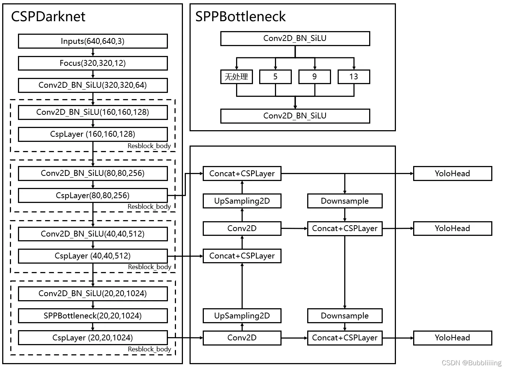
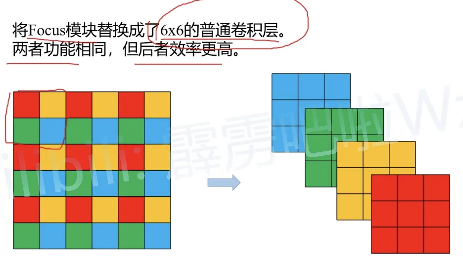
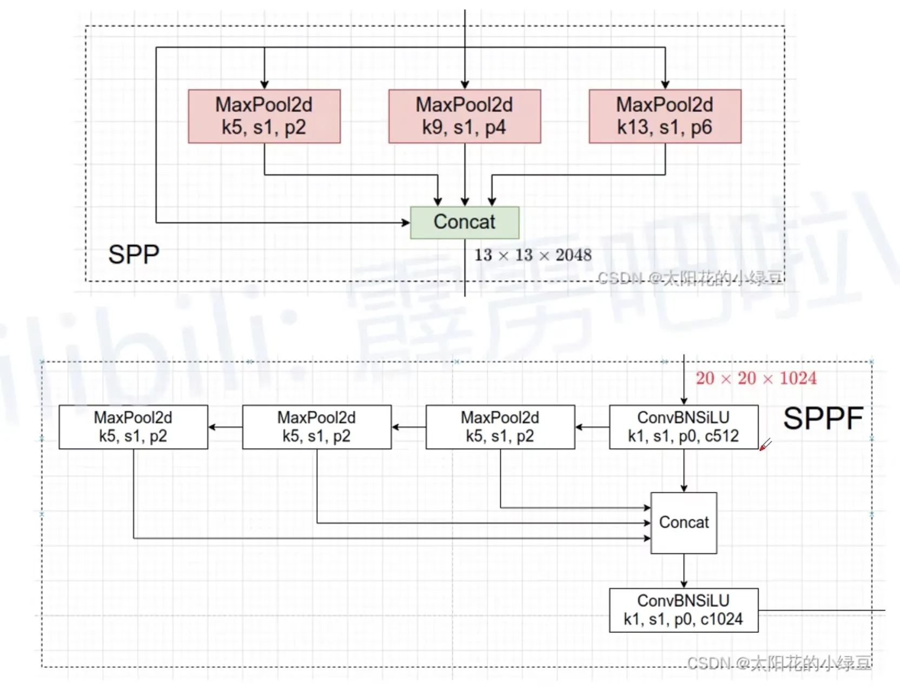

+++

title = "YOLOv5"

date = 2023-11-28

[taxonomies]

categories = ["2023"]

tags = ["yolo"]

+++



## 网络结构

- Backbone：New CSPDarknet 53
- Neck：SPPF，New CSP-PAN
- Head：YOLOv3 Head


## CSPDarknet 改动

- 添加了 Focus 模块
- 并把 Mish 激活函数换成了SiLU 激活函数

- 将 Resblock_body 拆成了CSPLayer 和 下采样层（原来是一起的）
- 将 SPP 插入到 backbone 的最后一层的下采样和 CSPLayer 之中

代码

```python
class CSPDarknet(nn.Module):
    def __init__(self, base_channels, base_depth, phi):
        super(CSPDarknet, self).__init__()

        #   640, 640, 3 -> 320, 320, 12 -> 320, 320, 64
        self.stem = Focus(3, base_channels, 3)

        self.block1 = nn.Sequential(
            BasicConv(base_channels, base_channels * 2, 3, 2),  # 下采样层
            CSPLayer(base_channels * 2, base_channels * 2, base_depth)
        )

        self.block2 = nn.Sequential(
            BasicConv(base_channels * 2, base_channels * 4, 3, 2),
            CSPLayer(base_channels * 4, base_channels * 4, base_depth * 3)
        )

        self.block3 = nn.Sequential(
            BasicConv(base_channels * 4, base_channels * 8, 3, 2),
            CSPLayer(base_channels * 8, base_channels * 8, base_depth * 3)
        )

        self.block4 = nn.Sequential(
            BasicConv(base_channels * 8, base_channels * 16, 3, 2),
            SPP(base_channels * 16, base_channels * 16),
            CSPLayer(base_channels * 16, base_channels * 16, base_depth, shortcut=False)
        )

    def forward(self, x):
        x = self.stem(x)

        x = self.block1(x)
        out2 = self.block2(x)
        out3 = self.block3(out2)
        out4 = self.block4(out3)

        return out2, out3, out4
```


## YOLO 的改动

- PAN 中的 Conv x 5 换成了 CSPLayer，此时 CSPLayer 不要短接边
- SPP 塞入了 backbone 中

## Focus

Focus模块，用于无损将一张 640x640x3的图像拆解为320x320x12的图像，再用一个3x3 卷积来提取特征和改变通道数



Focus 最初引用入 yolov5 中是为了取代 yolov3 的前三层，是一个 3 x 3 步幅 1 的卷积层和一个3x3步幅 2的下采样层，以及一个残差体，focus 利用无损下采样和一个 3x3步幅 1 的卷积层进行替换，输出 shape 相同但参数量和计算时间大幅减少 ，作者并没有测试对 map 的影响

Focus 模块在 YOLOv5 6.0 中被弃用，取而代之的是用 6*6 的卷积核，步幅为 2 进行卷积和下采样，主要目的简化架构方便导出模型

作用：

1. 无损下采样

代码：

```python
class Focus(nn.Module):
    def __init__(self, in_channels, out_channels, kernel_size):
        super(Focus, self).__init__()

        self.conv = BasicConv(in_channels * 4, out_channels, kernel_size)

    def forward(self, x):
        # 3 => 12
        x = torch.cat([
            x[..., ::2, ::2],  # 偶数行偶数列
            x[..., 1::2, ::2],
            x[..., ::2, 1::2],
            x[..., 1::2, 1::2]
        ], dim=1)
        # 12 => out_channels
        return self.conv(x)
```


## CSPLayer

v4 中的 Resblock_body 去掉下采样层得到的

将输入 x 分别经过同样的 1x1 卷积层降维得到x1 x2,这两部分中 x2 经过 n 个残差块并与 x1 拼接,拼接好后在通过 1x1 卷积层融合通道

```python
class CSPLayer(nn.Module):
    def __init__(self, in_channels, out_channels, num_blocks, shortcut=True, e=0.5):
        super(CSPLayer, self).__init__()

        hidden_channels = int(in_channels * e)

        self.part0_conv = BasicConv(in_channels, hidden_channels, 1)
        self.part1_conv = BasicConv(in_channels, hidden_channels, 1)
        self.part1_resblock = nn.Sequential(*[Resblock(hidden_channels, shortcut) for _ in range(num_blocks)])
        self.concat_conv3 = BasicConv(hidden_channels * 2, out_channels, 1)

    def forward(self, x):
        part0 = self.part0_conv(x)
        part1 = self.part1_conv(x)
        part1 = self.part1_resblock(part1)

        x = self.concat_conv3(torch.cat([part0, part1], dim=1))

        return x
```


## SPPF（v6.0）



SPPF 相对于 SPP，只是一个单纯的速度提高，从输入并行输送给 5x5 9x9 13x13的最大赤化层，而 SPPF 不再并行输入而是串行输入到 3 个串联的 5*5 的池化层中，两个 5 * 5 的池化层效果等于一个 9 * 9 的池化层，三个 5 * 5 的池化层效果等于一个 13 * 13 的池化层，最终的结果不变，但计算速度提升一倍

```py
class SPPF(nn.Module):
    # 输出的 channel 数可以手动设置
    def __init__(self, c1, c2, k=5):
        super(SPPF, self).__init__()
        c_ = c1 // 2  # hidden channels
        self.cv1 = BasicConv(c1, c_, 1, 1)
        self.cv2 = BasicConv(c_ * 4, c2, 1, 1)
        self.m = nn.MaxPool2d(kernel_size=k, stride=1, padding=k // 2)

    def forward(self, x):
        x = self.cv1(x)
        y1 = self.m(x)
        y2 = self.m(y1)
        y3 = self.m(y2)
        
        return self.cv2(torch.cat((x, y1, y2, y3), 1))
```

## 训练策略

- 多尺度训练：在 640 基础上 0.5 到 1.5 之间，只取 32 整数倍
- 聚类锚框：根据数据集锚框特点，重新聚类锚框的长宽
- 学习率预热：训练刚开始时学习率从一个比较小的值逐渐增加到设定的初始值，
- 余弦退火学习率：以余弦函数曲线的形式逐渐减小学习率，再突然回到初始值，以跳出局部最优点
- EMA：参数更新会加权历史变化